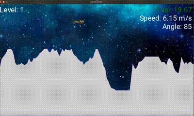

# Lunar Lander

Lunar Lander is a physics-based game where the player controls a lunar module's descent, adjusting thrust and angle to land safely on the moon's surface. The player must carefully balance speed and fuel to avoid crashing. This was developed using C#/.NET and MonoGame.

  

## Set up
1. Ensure C#/.NET, MonoGame, and this project are installed
2. Navigate to the 'LunarLander' directory and run 'dotnet build' and 'dotnet run'. 

